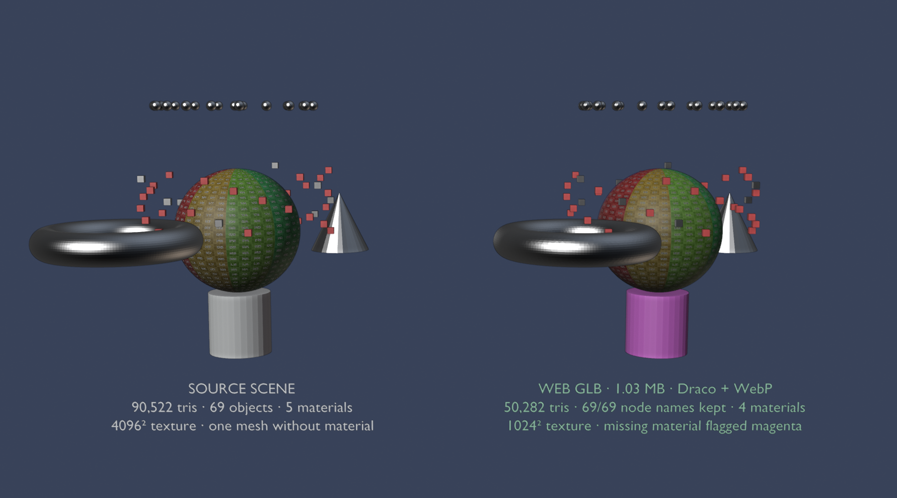

# Web-Ready Exporter

[](https://github.com/MikkoNurminenn/web-ready-exporter/actions/workflows/test.yml)


One-click Blender → browser GLB pipeline that **verifies its own output**. Audit, clean, decimate,
compress with Draco + WebP, then read the GLB back and fail loudly if a single node name went missing.
Built for Three.js product configurators, `<model-viewer>` pages and any web scene that looks up parts by name.



*Left: the test scene with every trap we could think of. Right: the exported GLB re-imported into Blender.
Same names, same hierarchy, half the triangles, one texture size, and the mesh that had no material is flagged magenta instead of silently rendering white.*

## Why

Generic glTF optimizers are great until your app does `scene.getObjectByName("Anchor_Seat_L")`.
On one production configurator a well-known optimizer merged meshes and pruned the "unused" empties
that positioned hotspots and accessories: 178 nodes became 43, the backrest disappeared and the hotspots
floated in the water. Nothing errored. The client saw it first.

Web-Ready Exporter does the optimizing *inside* Blender, on temporary copies, and treats node names as a
contract: whatever was in the export set must be in the GLB, or the export fails.

## What it does

| Step | Details |
|---|---|
| **Audit** (read-only) | material-less meshes, oversized textures, visually identical duplicate materials, mirrored (negative-determinant) and unapplied scales, loose vertices, open edges, n-gons, triangle budget overrun |
| **Prepare** (on copies) | evaluate modifiers · weld vertices (0.1 mm, skipped on meshes with custom normals) · drop loose vertices and zero-area faces · decimate to the triangle budget · merge identical materials · downscale textures · optional join-by-material · linked duplicates keep sharing one mesh |
| **Export** | GLB · Draco (level 6, 14/10/12-bit quantization) · WebP q80 · Y-up · no animation, cameras or lights |
| **Verify** | GLB parsed back in pure Python (no re-import): every expected node name present **or the export raises** · triangles · draw calls · meshes · textures · bytes · Draco flag |
| **Report** | `model.report.json` + `model.report.md` next to the GLB → [example](docs/example.report.md) |
| **LODs** | `0.5,0.25` → `model_lod1.glb`, `model_lod2.glb` with proportionally smaller budget and textures |

**Protected names.** Objects whose names start with `Anchor_`, `Hotspot_`, `Ctrl_`, `Pivot_` or `Socket_`
(configurable) are never joined or dropped, and are exported even when "Selected only" is on.

**Material-less meshes** get a magenta `WRE_Default` material so the gap is visible in the browser, or
fail the export in strict mode. Your source scene is never modified.

## Install

1. Download `web_ready_exporter-x.y.z.zip` from [Releases](https://github.com/MikkoNurminenn/web-ready-exporter/releases).
2. Blender → Edit → Preferences → Get Extensions → ▾ (top-right) → **Install from Disk…** → pick the zip.
3. 3D Viewport → sidebar (N) → **Web Export** tab.

Requires Blender 4.2 LTS or newer (tested on 4.2.23 and 5.2.0). Draco and WebP support ship with Blender's glTF add-on; no external tools.

## Use in Blender

Set the GLB path, triangle budget and max texture size → **Audit** (changes nothing, findings in the
system console) → **Export web GLB** → **Open report**. Turn on **Strict** for client deliveries.

## Use headless (agents, CI, batch)

```bash
blender -b scene.blend --python wre_cli.py -- --out out/model.glb --tris 300000 --tex 1024 --lods 0.5,0.25 --strict
```

The last line is `WRE_OK {"file": …, "megabytes": …, "triangles": …, "draw_calls": …, "nodes": …}` with
exit code **0**, or `WRE_FAIL <reason>` with exit code **1**.

| Flag | Default | Meaning |
|---|---|---|
| `--out` | – | output GLB (omit → audit only) |
| `--tris` | 300000 | triangle budget for the whole model; `0` disables decimation |
| `--tex` | 1024 | longest texture side in pixels |
| `--draco` | 6 | Draco compression level 0–10 |
| `--weld` | 0.0001 | weld distance in metres |
| `--protect` | `Anchor_,Hotspot_,Ctrl_,Pivot_,Socket_` | protected name prefixes |
| `--lods` | – | LOD ratios, e.g. `0.5,0.25` |
| `--merge` | off | join **unparented**, single-material, unprotected meshes per material (fewer draw calls, joined names are lost) |
| `--strict` | off | fail on audit errors instead of patching |
| `--selection` | off | export selected objects only (+ protected) |
| `--audit` | off | print the audit as JSON and stop |

Blender executables: macOS `/Applications/Blender.app/Contents/MacOS/Blender`, Linux `<extracted>/blender`,
Windows `"C:\Program Files\Blender Foundation\Blender 4.2\blender.exe"`.

### Notes for coding agents

- Run `--audit` first, read the `ERROR`/`WARN` lines, fix the source or choose flags, then export.
- Use `--strict` for anything a client will see. The magenta default material is meant to be noticed, not shipped.
- Read results from `model.report.json` (`outputs[0].triangles`, `draw_calls`, `megabytes`, `missing_names`).
  Do **not** re-import the GLB into Blender to measure it: glTF splits vertices at every hard edge and UV seam,
  so re-imported topology looks broken when it is not.
- Never use `--merge` on a model that an app addresses by object name.
- One Blender process at a time on shared machines; each run is a full Blender start.

## Test

```bash
tests/run_tests.sh /path/to/blender
```

`tests/trap_scene.py` builds a 69-object scene with every trap: a 65k-triangle hull with protected anchors in
a hierarchy, 40 bolts using three "different" but identical materials, a material-less cylinder with loose
vertices, a mirrored cone, a torus with an unapplied 2× scale and a subdivision modifier, 20 linked duplicates
sharing one mesh, and a 4096² texture. `tests/test_export.py` asserts names, budget, WebP, Draco, LODs,
instancing, merge behaviour, strict failure and that no working copies are left behind; `run_tests.sh` then
checks the CLI exit codes. CI runs it on Blender 4.2.23 and 5.2.0.

Latest local run (both versions):

| | Source | Web GLB |
|---|---|---|
| Triangles | 90,522 | 50,282 (budget 50k) |
| Materials | 5 | 4 |
| Texture | 4096² PNG | 1024² WebP |
| Meshes in GLB | – | 45 for 69 nodes (20 rivets share one) |
| Size | – | 1.03 MB, Draco |
| Node names | 69 | 69/69 |

## Limitations

- No KTX2/Basis texture compression (would need the external `toktx`); WebP covers most web cases.
- Decimation drops custom split normals on the meshes it touches; keep sharp CAD parts inside the budget.
- `--merge` joins only unparented single-material objects so hierarchies stay intact.
- Animations, skins and morph targets are intentionally excluded (static product models).
- Sidebar panel screenshot in the docs is still pending.

## License

MIT © 2026 Mikko Nurminen. Suomeksi: [README.fi.md](README.fi.md).
